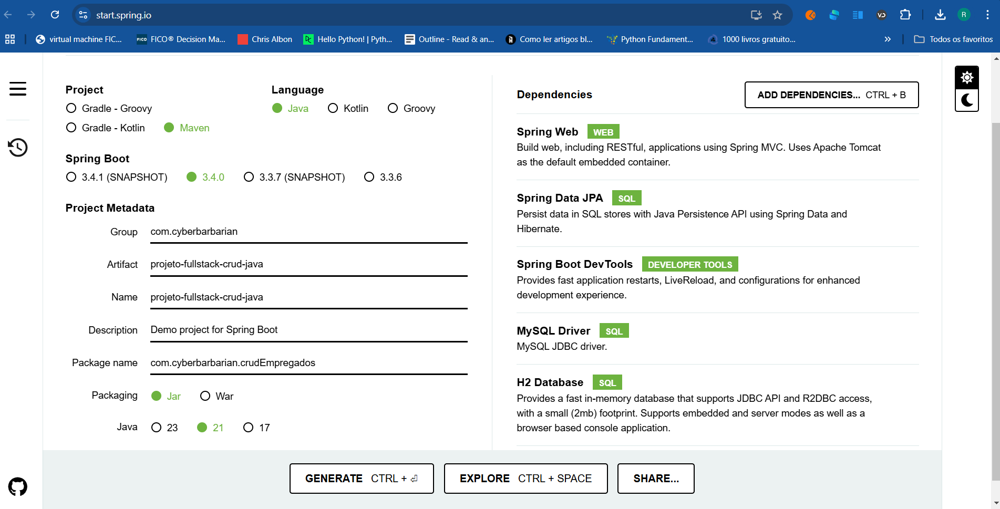

# Considerações iniciais

Para iniciar o projeto é preciso familiaridade com alguns conceitos fundamentais da arquitetura MVC (Model-View-Controller).

O padrão MVC (Model-View-Controller) é uma arquitetura de software amplamente utilizada para a construção de interfaces de usuário, separando a aplicação em três componentes interligados, cada um com responsabilidades distintas. Isso facilita a manutenção, a escalabilidade e a modularidade do código. 

**Model (Modelo)**
O Model representa os dados da aplicação e as regras de negócios. Ele é responsável por:
- Gerenciar os dados: Armazena e manipula os dados que a aplicação utiliza.
- Aplicar lógica de negócios: Contém a lógica que define como os dados são processados e transformados.
- Notificar mudanças: Informa a View sobre quaisquer alterações nos dados para que a interface do usuário possa ser atualizada.

**View (Visão)**
A View é a camada de apresentação responsável pela interface do usuário. Suas responsabilidades incluem:
- Renderizar dados: Exibe os dados fornecidos pelo Model de forma compreensível e atraente.
- Receber entrada do usuário: Coleta e exibe dados de entrada que o usuário fornece.
- Enviar comandos ao Controller: Repassa as ações do usuário para o Controller para processá-las.

**Controller (Controlador)**
O Controller atua como um intermediário entre o Model e a View. Suas funções principais são:

- Manipular a entrada do usuário: Recebe as entradas da View, processa-as e transforma-as em comandos para o Model.
- Atualizar o Model e View: Atualiza o Model com os novos dados e solicita à View que atualize a interface do usuário conforme necessário.
- Gerenciar o fluxo da aplicação: Define a lógica de controle e o fluxo de navegação da aplicação.

# Como Funciona o Fluxo MVC no nosso caso?
Em nosso projeto estamos lidando com um projeto JPA de criação de CRUD de Empregados no padrão MVC (Model-View-Controller). Cada componente tem um papel específico.
## Model
O **Model** representa os dados da aplicação e as regras de negócios, e, no contexto de JPA, inclui as entidades JPA que mapeiam as tabelas do banco de dados. Ele também inclui a camada de acesso a dados (repositories) e serviços que contêm a lógica de negócios.
- Entidades JPA: Classes anotadas com @Entity que representam tabelas do banco de dados.
- Repositórios (Repositories): Interfaces que estendem JpaRepository ou CrudRepository para fornecer métodos de persistência de dados.
- Serviços (Services): Classes que contêm a lógica de negócios e interagem com os repositórios.

## View
A **View** é a camada de apresentação que interage com o usuário. Em um projeto web, as Views são páginas HTML/Thymeleaf/FreeMarker que exibem os dados do Model e recebem as entradas do usuário.
- Templates: Arquivos HTML que utilizam Thymeleaf, FreeMarker, Angular ou outro mecanismo de template para renderizar dados dinâmicos.
- Componentes de Interface: Tags e componentes HTML que compõem a interface do usuário.

## Controller (Controlador)
O **Controller** é responsável por capturar e processar as requisições do usuário, interagir com o Model para realizar operações de negócios e determinar a View apropriada para renderizar a resposta.
- Controladores REST: Classes anotadas com **@RestController** para expor APIs RESTful.
- Controladores MVC: Classes anotadas com **@Controller** que retornam Views.

## Resumo
- Model: Inclui entidades JPA, repositórios e serviços. Gerencia os dados e lógica de negócios.
- View: Camada de apresentação, geralmente composta por templates HTML que exibem dados ao usuário.
- Controller: Captura requisições do usuário, chama serviços do Model e retorna Views ou dados JSON.

**O padrão MVC promove uma clara separação de preocupações, tornando o código mais modular e fácil de manter. Isso facilita a colaboração entre equipes, permitindo que desenvolvedores de backend e frontend trabalhem simultaneamente sem conflitos.**


# 01-Iniciando o projeto

Primeiramente criamos o projeto por meio do Spring Initializr https://start.spring.io/.
O Spring Initializr é uma ferramenta web que permite criar projetos Spring Boot a partir de configurações pré-moldadas. Ele é uma forma fácil de iniciar um projeto Spring Boot, pois oferece uma interface simples para o usuário.

O projeto será montado da seguinte forma:




Após descompactado, podemos verificar o conteúdo do projeto, sua estrutura de pastas e, sobretudo, o arquivo [pom.xml](..%2Fpom.xml), que contém todas as dependências.

O projeto inclusive já pode ser executado:


# 02-Configurando o banco de dados
Nesse projeto foram incluídos dois bancos de dados: o H2 e o MySQL.

O H2 é um banco de dados de código aberto e leve, que roda em memória, para o desenvolvimento e teste de APIs. Como ele roda em memória e é um banco de dados de testes, não há necessidade de nenhuma configuração extra. Apenas chamá-lo no [pom.xml](..%2Fpom.xml). 

Já o MySQL é um banco de dados de base de dados relacional, que roda em um servidor de base de dados e possibilita a criação de aplicativos de rede. Para usá-lo, além de importar a dependência pelo [pom.xml](..%2Fpom.xml) precisamos configurar o [application.properties](..%2Fsrc%2Fmain%2Fresources%2Fapplication.properties) para se conectar ao banco de dados MySQL, adicinando as credenciais a seguinte configuração.

```text
spring.datasource.url = jdbc:mysql://localhost:3306/users_database?useSSL=false
spring.datasource.username = root
spring.datasource.password = root


## Hibernate Properties
# The SQL dialect makes Hibernate generate better SQL for the chosen database
spring.jpa.properties.hibernate.dialect = org.hibernate.dialect.MySQL5InnoDBDialect

# Hibernate ddl auto (create, create-drop, validate, update)
spring.jpa.hibernate.ddl-auto = update

server.servlet.context-path=/springboot-crud-rest
```
Devemos ter o MySQL instalado e configurado, bem como preferencialmente o MySQL Workbench. Com o MySQL Workbench, podemos criar um novo banco de dados, uma nova tabela e inserir alguns dados mockados:

Criamos uma tablela no MySQL Workbench com o seguinte script:
[EmpregadosDdl.sql](EmpregadosDdl.sql)
```sql
CREATE DATABASE IF NOT EXISTS recursos_humanos;

USE recursos_humanos;

DROP TABLE IF EXISTS empregados;

CREATE TABLE IF NOT EXISTS empregados (
    id BIGINT AUTO_INCREMENT PRIMARY KEY,
    nome VARCHAR(100) NOT NULL,
    cargo VARCHAR(100) NOT NULL,
    salario FLOAT NOT NULL,
    data_nascimento DATE NOT NULL,
    numero_dependentes BIGINT,
    email_corporativo VARCHAR(100)
);

INSERT INTO empregados (nome, cargo, salario, data_nascimento, numero_dependentes, email_corporativo) VALUES
('Ana Silva', 'Gerente de Projetos', 7500.00, '1985-06-15', 2, 'ana.silva@empresa.com'),
('Bruno Souza', 'Desenvolvedor', 5000.00, '1990-03-10', NULL, 'bruno.souza@empresa.com'),
('Carlos Oliveira', 'Analista de Sistemas', 6200.00, '1988-12-20', 1, 'carlos.oliveira@empresa.com'),
('Daniela Santos', 'Design Gráfico', 4500.00, '1992-07-25', NULL, NULL),
('Eduardo Lima', 'Administrador de Banco de Dados', 7000.00, '1983-05-05', 3, 'eduardo.lima@empresa.com'),
('Fernanda Rocha', 'Analista de Marketing', 4800.00, '1986-09-18', 1, NULL),
('Gustavo Pereira', 'Engenheiro de Software', 8000.00, '1987-11-30', 2, 'gustavo.pereira@empresa.com'),
('Helena Costa', 'Recursos Humanos', 5300.00, '1991-02-14', NULL, 'helena.costa@empresa.com'),
('Igor Mendes', 'Suporte Técnico', 3700.00, '1993-04-23', 1, 'igor.mendes@empresa.com'),
('Juliana Martins', 'Gerente Financeiro', 9000.00, '1982-08-09', 4, 'juliana.martins@empresa.com'),
('Leonardo Alves', 'Desenvolvedor Mobile', 5500.00, '1989-10-11', NULL, 'leonardo.alves@empresa.com'),
('Mariana Ferreira', 'Analista de Dados', 6000.00, '1984-01-19', 2, NULL),
('Nicolas Ribeiro', 'Arquiteto de Soluções', 9500.00, '1981-12-01', 3, 'nicolas.ribeiro@empresa.com'),
('Paula Andrade', 'Coordenadora de TI', 8200.00, '1985-07-06', 1, 'paula.andrade@empresa.com'),
('Rafael Campos', 'Tester', 4000.00, '1992-03-15', NULL, 'rafael.campos@empresa.com'),
('Sofia Moreira', 'Engenheiro de Software', 8238.00, '1987-11-30', 1, 'sofia.moreira@empresa.com'),
('Thiago Nunes', 'Desenvolvedor', 5238.00, '1990-03-10', 1, NULL),
('Ursula Souza', 'Analista de Sistemas', 6438.00, '1988-12-20', 0, 'ursula.souza@empresa.com'),
('Victor Oliveira', 'Gerente de Projetos', 7738.00, '1985-06-15', 2, 'victor.oliveira@empresa.com'),
('Yara Silva', 'Administrador de Banco de Dados', 7238.00, '1983-05-05', 3, 'yara.silva@empresa.com'),
('Zeca Rocha', 'Analista de Marketing', 5038.00, '1986-09-18', 1, NULL),
('André Lima', 'Engenheiro de Software', 7762.00, '1987-11-30', 2, 'andre.lima@empresa.com'),
('Beto Santos', 'Recursos Humanos', 5538.00, '1991-02-14', NULL, 'beto.santos@empresa.com'),
('Carlos Mendes', 'Suporte Técnico', 3938.00, '1993-04-23', 1, 'carlos.mendes@empresa.com'),
('Denise Ferreira', 'Gerente Financeiro', 8762.00, '1982-08-09', 4, NULL),
('Elena Martins', 'Desenvolvedor Mobile', 5262.00, '1989-10-11', 0, 'elena.martins@empresa.com'),
('Fabio Souza', 'Analista de Dados', 5762.00, '1984-01-19', 2, 'fabio.souza@empresa.com'),
('Gabriel Ribeiro', 'Arquiteto de Soluções', 9262.00, '1981-12-01', 3, 'gabriel.ribeiro@empresa.com'),
('Hugo Andrade', 'Coordenadora de TI', 8438.00, '1985-07-06', 1, 'hugo.andrade@empresa.com'),
('Isabela Campos', 'Tester', 4238.00, '1992-03-15', NULL, 'isabela.campos@empresa.com'),
('Júlia Moreira', 'Engenheiro de Software', 7762.00, '1987-11-30', 1, 'julia.moreira@empresa.com'),
('Kevin Nunes', 'Desenvolvedor', 5238.00, '1990-03-10', 1, 'kevin.nunes@empresa.com'),
('Lara Souza', 'Analista de Sistemas', 6438.00, '1988-12-20', 0, 'lara.souza@empresa.com'),
('Marcelo Oliveira', 'Gerente de Projetos', 7738.00, '1985-06-15', 2, 'marcelo.oliveira@empresa.com'),
('Nina Silva', 'Administrador de Banco de Dados', 7238.00, '1983-05-05', 3, 'nina.silva@empresa.com'),
('Oscar Rocha', 'Analista de Marketing', 5038.00, '1986-09-18', 1, NULL),
('Pedro Lima', 'Engenheiro de Software', 8238.00, '1987-11-30', 2, 'pedro.lima@empresa.com'),
('Quésia Santos', 'Recursos Humanos', 5538.00, '1991-02-14', NULL, 'quesia.santos@empresa.com'),
('Renato Mendes', 'Suporte Técnico', 3938.00, '1993-04-23', 1, 'renato.mendes@empresa.com'),
('Sabrina Ferreira', 'Gerente Financeiro', 8762.00, '1982-08-09', 4, NULL),
('Tânia Martins', 'Desenvolvedor Mobile', 5262.00, '1989-10-11', 0, 'tania.martins@empresa.com'),
('Ulisses Souza', 'Analista de Dados', 5762.00, '1984-01-19', 2, 'ulisses.souza@empresa.com'),
('Valentina Ribeiro', 'Arquiteto de Soluções', 9262.00, '1981-12-01', 3, NULL),
('Wagner Andrade', 'Coordenadora de TI', 8438.00, '1985-07-06', 1, 'wagner.andrade@empresa.com'),
('Xavier Campos', 'Tester', 4238.00, '1992-03-15', NULL, 'xavier.campos@empresa.com'),
('Yasmin Moreira', 'Engenheiro de Software', 7762.00, '1987-11-30', 1, 'yasmin.moreira@empresa.com'),
('Zilda Nunes', 'Desenvolvedor', 5238.00, '1990-03-10', 1, 'zilda.nunes@empresa.com'),
('Arthur Souza', 'Analista de Sistemas', 6438.00, '1988-12-20', 0, 'arthur.souza@empresa.com');
```


# 03 - Criando a entidade de empregados
JPA (ou Java Persistence API) é uma especificação oficial que descreve como deve ser o comportamento dos frameworks de persistência Java que desejarem implementá-la.

Podemos pensar na especificação JPA como uma interface que possui algumas assinaturas, mas que precisa que alguém a implemente.

Mapeamento Objeto Relacional é a representação de uma tabela de um banco de dados relacional através de classes Java.

É também conhecido como ORM ou Object Relational Mapping.

Enquanto que no banco de dados temos tabelas, colunas e registros, em uma linguagem orientada a objetos, como o Java, temos o equivalente com classes, atributos e objetos.

Sendo assim, com a finalidade de criar uma tabela  devemos criar uma classe de entidades equivalente (**Entity**).

Vamos prosseguir entõ com a criação de uma entidade que representa a tabela de empregados que terá os seguintes atributos (colunas):
- id - Chave primária
- nome - Nome do empregado
- cargo - Cargo do empregado
- salario - Salário do empregado
- dataNascimento - Data de nascimento
- numeroDependentes - Quantidade de dependentes
- emailCorporativo - Email

Para este projeto, a princípio, tentaremos seguir a estrutura de diretórios abaixo:


Portanto, dentro da pasta do projeto vamos criar a pasta entity e dentro dela a classe Empregado.java, usando a anotação *@Entity* e a anotação *@Table*, que demonstrará ao spring que essa classe representa uma tabela. 

Dentro de nossa classe iniciamos a criação de atributos privados e métodos construtores normalmente. Entretanto, precisaremos criar um getter e um setter para cada atributo, devemos estar atentos às anotações *@Id*, *@GeneratedValue* e *@Column*, que evem vir sobre os gets.

[Empregado.java](..%2Fsrc%2Fmain%2Fjava%2Fcom%2Fcyberbarbarian%2FcrudEmpregados%2Fentity%2FEmpregado.java)

```java
package com.cyberbarbarian.crudEmpregados.entity;

import jakarta.persistence.*;

import java.time.LocalDate;

@Entity
@Table(name = "empregados")
public class Empregado {
    //Passo 1 - criação dos atributos
    private long id;
    private String nome;
    private String cargo;
    private float salario;
    private LocalDate dataNascimento;
    private long numeroDependentes;
    private String emailCorporativo;

    //Passo 2 - criação dos construtores
    public Empregado () {
    }

    public Empregado(long id, String nome, String cargo, float salario, LocalDate dataNascimento, long numeroDependentes, String emailCorporativo) {
        this.id = id;
        this.nome = nome;
        this.cargo = cargo;
        this.salario = salario;
        this.dataNascimento = dataNascimento;
        this.numeroDependentes = numeroDependentes;
        this.emailCorporativo = emailCorporativo;
    }

    //Passo 3 - criação dos getters e setters com as devidas anotações

    @Id
    @GeneratedValue(strategy = GenerationType.IDENTITY)//melhor com mysal
    public long getId() {
        return id;
    }

    public void setId(long id) {
        this.id = id;
    }
    @Column(name = "nome", nullable = false)
    public String getNome() {
        return nome;
    }

    public void setNome(String nome) {
        this.nome = nome;
    }
    @Column(name = "cargo", nullable = false)
    public String getCargo() {
        return cargo;
    }

    public void setCargo(String cargo) {
        this.cargo = cargo;
    }
    @Column(name = "salario", nullable = false)
    public float getSalario() {
        return salario;
    }

    public void setSalario(float salario) {
        this.salario = salario;
    }
    @Column(name = "data_nascimento", nullable = false)
    public LocalDate getDataNascimento() {
        return dataNascimento;
    }

    public void setDataNascimento(LocalDate dataNascimento) {
        this.dataNascimento = dataNascimento;
    }
    @Column(name = "numero_dependentes")
    public long getNumeroDependentes() {
        return numeroDependentes;
    }

    public void setNumeroDependentes(long numeroDependentes) {
        this.numeroDependentes = numeroDependentes;
    }

    @Column(name = "email_corporativo")
    public String getEmailCorporativo() {
        return emailCorporativo;
    }

    public void setEmailCorporativo(String emailCorporativo) {
        this.emailCorporativo = emailCorporativo;
    }

    //Passo 4 - criação do toString para a classe
    @Override
    public String toString() {
        return "Empregado{" +
                "id=" + id +
                ", nome='" + nome + '\'' +
                ", cargo='" + cargo + '\'' +
                ", salario=" + salario +
                ", dataNascimento=" + dataNascimento +
                ", numeroDependentes=" + numeroDependentes +
                ", emailCorporativo='" + emailCorporativo + '\'' +
                '}';
    }
}

```

# 04 - Criando o repositório de empregados

Em JPA (Java Persistence API), um repositório é uma **interface** que fornece métodos para realizar operações de persistência, como salvar, atualizar, deletar e buscar dados no banco de dados. 

O repositório é parte integrante do padrão de design Repository, que **separa a lógica de negócios do acesso aos dados**.

Em nosso caso vamos criar um repositório para a entidade Empregado através de uma interface chamada EmpregadoRepository, dentro da pasta repository. 

Ele extende a interface *JpaRepository*, interface essa que define métodos necessários para realizar as operações de um CRUD.

A extensão da *JpaRepository* exige a declaração da entidade e do tipo da chave primária, nesse caso *<Empregado, Long>*.

À interface precisamos adicionar a anotação *@Repository*, que indica que essa interface representa um repositório, além de importar a classe de entidade.
[EmpregadoRepository.java](..%2Fsrc%2Fmain%2Fjava%2Fcom%2Fcyberbarbarian%2FcrudEmpregados%2Frepository%2FEmpregadoRepository.java)
```java 
package com.cyberbarbarian.crudEmpregados.repository;

import com.cyberbarbarian.crudEmpregados.entity.Empregado;
import org.springframework.data.jpa.repository.JpaRepository;
import org.springframework.stereotype.Repository;

@Repository
public interface EmpregadoRepository extends JpaRepository<Empregado, Long> {
}

```

# 05 - Criando o controller (@RestController)

O Controller em uma aplicação Spring MVC (Model-View-Controller) é responsável por manipular as requisições HTTP, interagir com a camada de serviço e determinar qual resposta enviar de volta ao cliente (navegador, aplicativo móvel, etc.).

Basicamente, ele atua como intermediário entre a View (interface do usuário) e o Model (dados).

Nesse primeiro momento, como não temos view ainda, nosso controller irá trabalhar no desenvolvimento de 5 REST endpoints que seão testados via Postman:

| Método HTTP | Path                             | Descrição                                          |
|-------------|----------------------------------|----------------------------------------------------|
| GET         | /api/v1/empregados               | Recupera uma lista de todos os empregados.         |
| POST        | /api/v1/empregados               | Cria um novo empregado.                            |
| GET         | /api/v1/empregados/{id}          | Recupera os detalhes de um empregado específico.   |
| PUT         | /api/v1/empregados/{id}          | Atualiza os dados de um empregado existente.       |
| DELETE      | /api/v1/empregados/{id}          | Remove um empregado específico.                    |


Obs: continuar a criação do controller